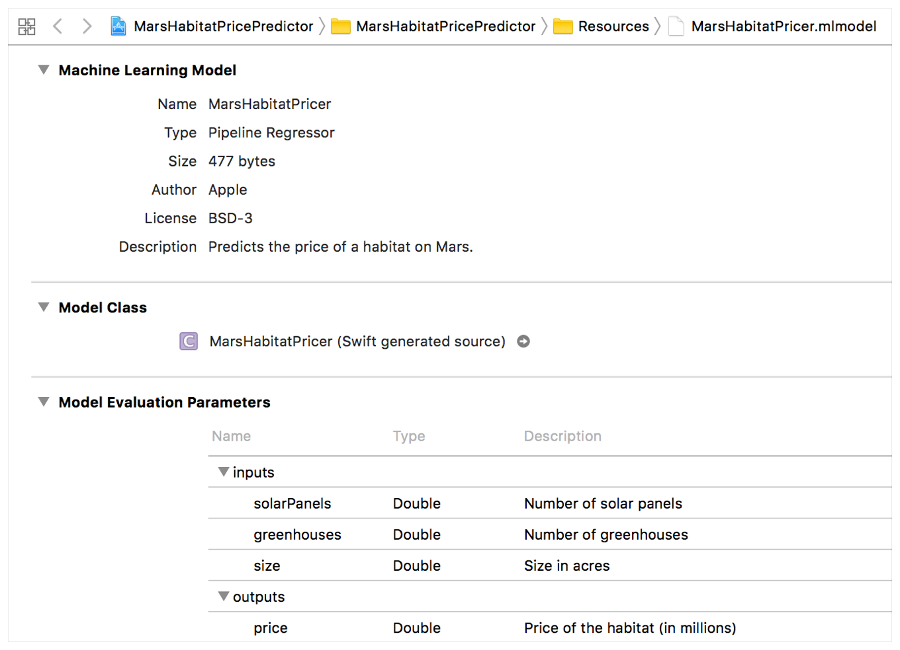

# Integrating a Core ML Model into Your App

Add a simple model to an app, 
pass input data to the model, and process the model's predictions. 

## Overview

This sample app uses a trained model, `MarsHabitatPricer.mlmodel`, 
to predict habitat prices on Mars.

## Adding a Model to Your Xcode Project

Add the model to your Xcode project by dragging the model into the project 
navigator. 

You can see information about the model—including 
the model type and its expected inputs and outputs—by 
opening the model in Xcode. 
The inputs to the 
model are the number of solar panels and greenhouses, as well 
as the lot size of the habitat (in acres). 
The output of the model is the predicted price of the habitat.



## Creating the Model in Code

Xcode also uses information about the model’s inputs and outputs to 
automatically generate a custom programmatic interface to the model, 
which you use to interact with the model in your code.
For `MarsHabitatPricer.mlmodel`, Xcode generates interfaces to 
represent the model (`MarsHabitatPricer`), the model’s inputs (`MarsHabitatPricerInput`), 
and the model’s output (`MarsHabitatPricerOutput`).

Use the generated `MarsHabitatPricer` class’s initializer to create the model:

``` swift
let model = MarsHabitatPricer()
```

## Getting Input Values to Pass to the Model

This sample app uses a `UIPickerView` to get the model’s input values from the user:

``` swift
func selectedRow(for feature: Feature) -> Int {
    return pickerView.selectedRow(inComponent: feature.rawValue)
}

let solarPanels = pickerDataSource.value(for: selectedRow(for: .solarPanels), feature: .solarPanels)
let greenhouses = pickerDataSource.value(for: selectedRow(for: .greenhouses), feature: .greenhouses)
let size = pickerDataSource.value(for: selectedRow(for: .size), feature: .size)
```

## Using the Model to Make Predictions

The `MarsHabitatPricer` class has a generated 
`prediction(solarPanels:greenhouses:size:)` method that’s used to predict a
price from the model’s input values—in this case, the number of solar panels,
the number of greenhouses, and the size of the habitat (in acres). The result of
this method is a `MarsHabitatPricerOutput` instance, `marsHabitatPricerOutput`.

``` swift
guard let marsHabitatPricerOutput = try? model.prediction(solarPanels: solarPanels, greenhouses: greenhouses, size: size) else {
    fatalError("Unexpected runtime error.")
}
```

Access the `price` property of `marsHabitatPricerOutput` to get a predicted price 
and display the result in the app’s UI.

``` swift
let price = marsHabitatPricerOutput.price
priceLabel.text = priceFormatter.string(for: price)
```

- Note: The generated `prediction(solarPanels:greenhouses:size:)` method can throw an error. The most common type of errors you’ll encounter in working with Core ML occur when the type of input data you pass to the method doesn’t match the type of input the model is expecting—for example, an image in the wrong format. In this sample app, the inputs are of type `Double`. Any type mismatches are caught at compile time, and the sample app raises a fatal error if something goes wrong.

## Building and Running a Core ML App 

Xcode compiles the Core ML model 
into a resource that’s been optimized to run on a device. 
This optimized representation of the model is included in your app bundle
and is what’s used to make predictions while the app is running on a device. 

